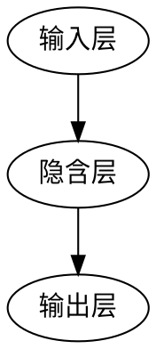
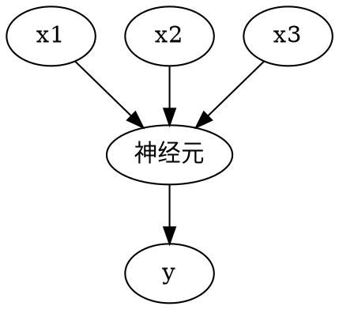

@import "https://cdn.plot.ly/plotly-latest.min.js"
## 神经网络初识小记
### 神经网络的起源和功能
神经网络是仿生学产物,模拟人的神经元工作.主要功能是分类识别,包括图像,语音,文本的分类识别.其中图像,语音是密集型矩阵;文本是稀疏型矩阵.
### 神经网络的基本概念
#### 网络结构
神经网络的网络结构主要由输入层,隐含层,输出层组成.相对于隐含层单层维度上的增长,隐含层深度的增长对网络能力由更显著的升.通常会把问题分解,当对网络层数增加的时候就增加一个或多个理解力.

#### 单个神经元的的结构
单个神经元中包含一个线性函数$z=W^Tx+b$和激励函数$a=g(z)$.其中$z=W^Tx+b$相当于是线性值输入大脑的值,$a=g(z)$是大脑真实记住的值.
#### 激励函数
激励函数能提供规模化的非线性能力,对大脑神经元活动的模拟,常用激励函数有
| 函数名称 | 函数表达式  | 函数缺点   | 函数优点 |
| -------- | ------------------------------------ | ----------------- | ---------- |
| sigmoid  | $f(x)=\frac{1}{1+e^{-x}}$            | 中心点是(0.5,0.5),$x$过大或过小时不敏感 | 全局可导               |
| tanh     | $f(x)=\frac{e^x-e^{-x}}{e^x+e^{-x}}$ | $x$过大或过小时不敏感                   | 中心点是(0,0),全局可导 |
| ReLU     | $f(x)=\max(0,x)$                     | $x<0$时为0,建议可以取较小的斜率进行优化 | 目前应用最广泛         |
@import "/assets/sigmoid.jpeg"
sigmoid函数图像
@import "/assets/tanh.jpeg"
tanh函数图像
@import "/assets/relu.jpeg"
ReLU函数图像
#### 逻辑回归
逻辑回归可以看成是一种最简单的网络结构.神经网络中只包含一个隐含层隐含层中只包含一个神经元.逻辑回归就是激活函数$g(z)$不断趋近于$y$的过程

#### 损失函数
损失函数表示样本真实值和训练所得值之间的差异.单词训练的损失函数表达式如下:
$$ L(y^{(i)},y_1^{(i)})=-(y^{(i)}\log(y_1^{(i)}))+(1-y^{(i)})\log(1-y_1^{(i)})$$
式中$y^{(i)}$是样本标准值,$y_1^{(i)}$是训练所得值.在这里损失函数没用使用欧几里得距离,如果使用欧几里得距离作为损失函数时所得的损失函数平面不一定是凸平面,梯度下降的效果和损失函数平面是否是图平面有关.如果有多个最小值会使学习结果不是最优的$L(y^{(i)},y_1^{(i)})$损失函数的平面是一个凸平面.
全部训练损失的表达式如下:
$$J(w,b)=\frac{1}{m}\sum_{i=1}^mL(y^{(i)},y_1^{(i)})$$
#### 梯度下降
